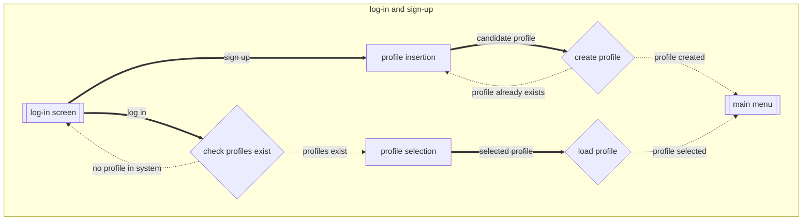
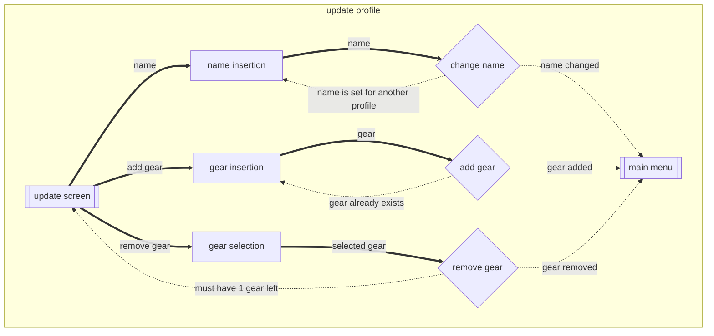
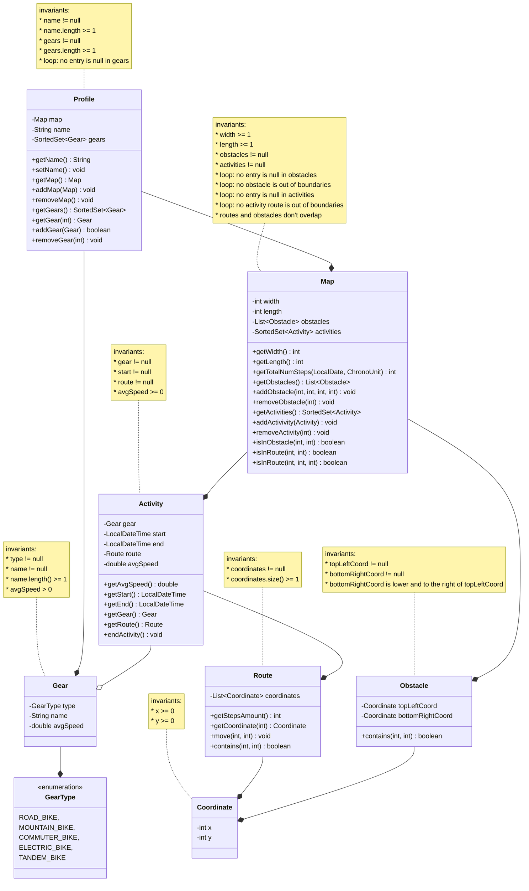

* Title: Franklin Runs
* Author: Narek Veranyan (veranyan@myumanitoba.ca)
---

# Overview
> Franklin Runs is an implementation of an exercise tracker software for COMP 2450 
> specifically designed for tracking cycling activities. The software offers
>
>   * A user-defined grid-structured map to track an activity.
>   * There are obstacles that can be added to the map.
>   * There are gears to be recorded and later added to an activity.

## Vision Statement
> Build software that allows exercises to track activities and gear, record obstacles,
> share exercise information with friends, and find routes on a map.

## Resources
* used the following existing system to come up with classes in the domain model: <https://www.strava.com/>
* found information about bike types: <https://www.edinburghbicycle.com/info/blog/types-of-bikes-buying-guide>

## Running
This project was built using Maven and developed in IntelliJ IDEA.

* Prerequisites to run the program:
    1. Java JDK 21 or newer
    2. Apache Maven

* Setup
1. Install the Java JDK if it is not already installed.
2. Install Apache Maven and make sure the mvn command is available from your terminal.
3. Verify that both are installed:
```
java --version
mvn --version
```
4. Open a terminal in the project directory.
5. Compile and run the application:
```
mvn compile exec:java "-Dexec.mainClass=ca.umanitoba.cs.veranyan.Main"
```

# User Flow Diagram

### log-in and sign-up



### update profile



# Domain Model Diagram

Here's my domain model:

> changes:
> 1. Exerciser class renamed Profile
> 2. Added name attribute to Profile, changed invariant accordingly
> 3. changed method to Profile::addGear(Gear) boolean


