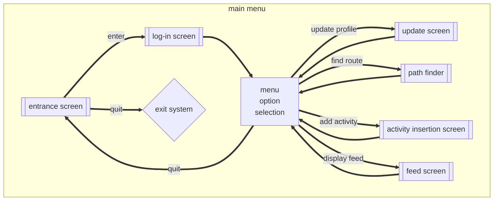
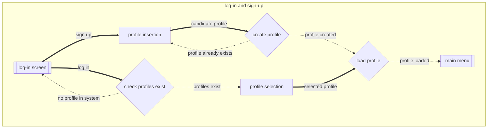
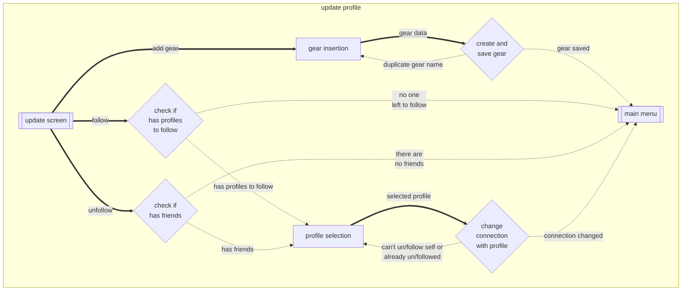
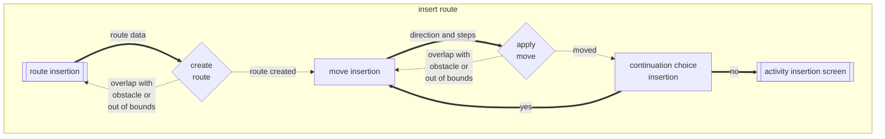
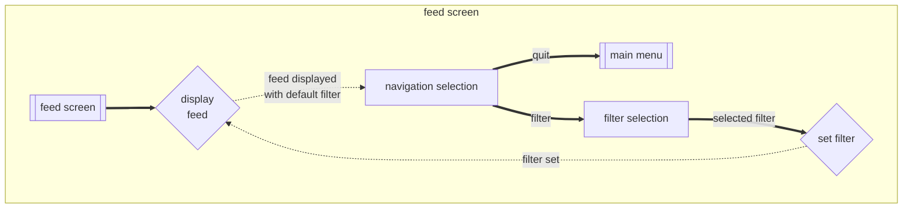
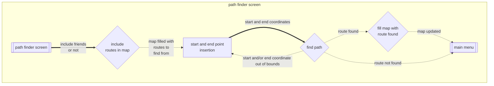
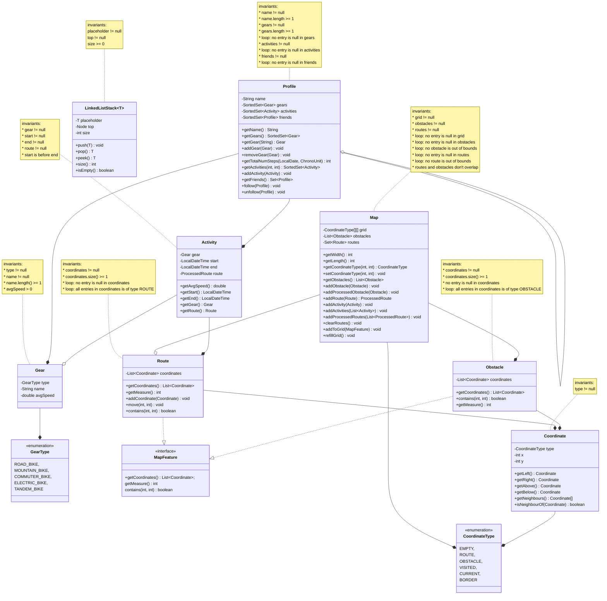

* Title: Franklin Runs
* Author: Narek Veranyan (veranyan@myumanitoba.ca)
---

# Overview
> Franklin Runs is an implementation of an exercise tracker software for COMP 2450 
> specifically designed for tracking cycling activities. The software offers
>
>   * Multiple profiles in the system that can share routes and view each other's activities,
>   * A feed of activities with each route displayed on a user-defined grid-structured map, 
>   * There are routes and obstacles that can be added to the map,
>   * There are gears to be added and later used in an activity,
>   * Persistence for user progress,
>   * A rigorous test suite for all the layers and domain model objects. 

## Vision Statement
> Build software that allows exercises to track activities and gear, record obstacles,
> share exercise information with friends, and find routes on a map.

## Resources
* used the following existing system to come up with classes in the domain model: <https://www.strava.com/>
* found information about bike types: <https://www.edinburghbicycle.com/info/blog/types-of-bikes-buying-guide>

## Running
This project was built using Maven and developed in IntelliJ IDEA.

* Prerequisites to run the program:
    1. Java JDK 21 or newer
    2. Apache Maven

* Setup
1. Install the Java JDK if it is not already installed.
2. Install Apache Maven and make sure the mvn command is available from your terminal.
3. Verify that both are installed:
```
java --version
mvn --version
```
4. Open a terminal in the project directory.
5. Compile and run the application:
```
mvn compile exec:java "-Dexec.mainClass=ca.umanitoba.cs.veranyan.Main"
```

# User Flow Diagram

### main menu



### log-in and sign-up



### update profile

#### Note: 
> Error outputs for checking if there are profiles to follow or if profile has friends
> do not go back to the previous subtask but to the ending subtask so that the user is not
> left with the only available choice being to select the other 2 options, while it was not
> the original intention.



### insert activity

```mermaid
flowchart TD
subgraph insert activity
    activityInsertionScreen[[activity insertion screen]]
    
    activityInsertionScreen ==> determineGearAvailability
    
    determineGearAvailability{check gear\n available}
    
    determineGearAvailability -. no gear available .-> mainMenu
    
    determineGearAvailability -. gear available .-> gearSelection
    
    gearSelection[gear selection]

    gearSelection == gear ==> saveGear{save gear}
    
    saveGear -. gear saved .-> routeConstructionTypeSelection[route construction \n type selection]
    
    %% route creation
    routeConstructionTypeSelection == create route ==> routeInsertion[[route insertion screen]]
    
    routeInsertion == route ==> saveRoute
    
    %% route selection
    routeConstructionTypeSelection == select route ==> determineRouteAvailability{check route\n available}

    determineRouteAvailability -. no routes available .-> routeConstructionTypeSelection

    determineRouteAvailability -. route available .-> routeSelection[route \n selection]
    
    routeSelection == route ==> saveRoute
    
    %% final processing
    saveRoute{save route}
    
    saveRoute -. route saved .-> obstacleCreationChoiceInsertion
    
    %% obstacle insertion
    obstacleCreationChoiceInsertion[obstacle creation \n choice insertion]
    
    obstacleCreationChoiceInsertion == insert obstacle ==> obstacleInsertion[obstacle insertion]

    obstacleCreationChoiceInsertion == skip ==> mainMenu[main menu]
    
    obstacleInsertion == obstacle data ==> saveObstacle{create and \n save obstacle}

    saveObstacle -. overlap with route \n or out of bounds .-> obstacleInsertion
    
    saveObstacle -. obstacle saved .-> mainMenu[[main menu]]
    
end
```



### insert route



### feed



### path finder



# Domain Model Diagram

## Resources
* used the following existing system to come up with classes in the domain model: <https://www.strava.com/>
* found information about bike types: <https://www.edinburghbicycle.com/info/blog/types-of-bikes-buying-guide>

Here's my updated diagram for my domain model:

> changes:
> 
> ### Profile
> - removed `removeActivity` and `getRoutes` methods
> 
> ### Map
> - removed `removeObstacle` method
> - replaced `addProcessedRoute` method with `addActivity`
> - added `addActivities` method
> - renamed `appendToGrid` method to `addToGrid`
> - added `addProcessedObstacle` method for loading obstacles without persisting


